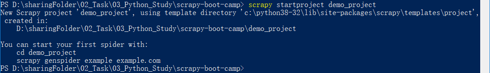
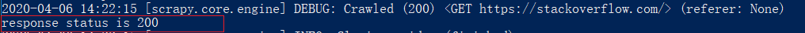
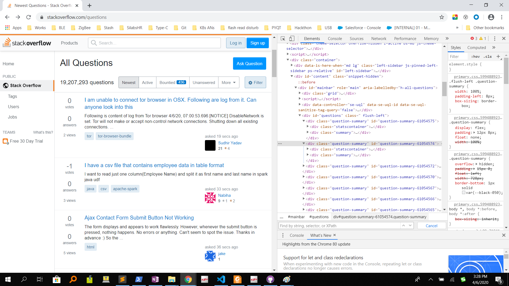
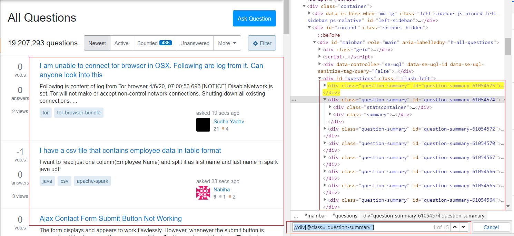
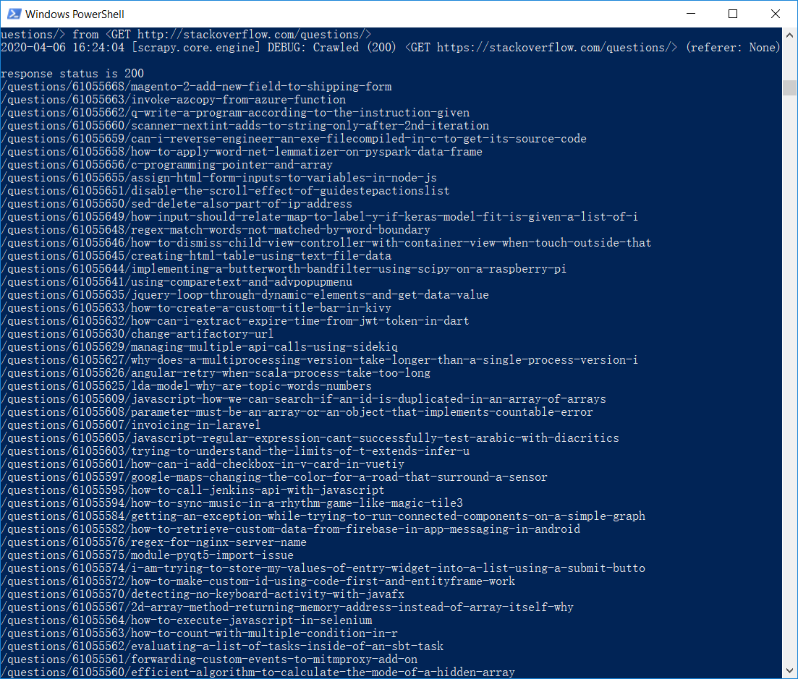
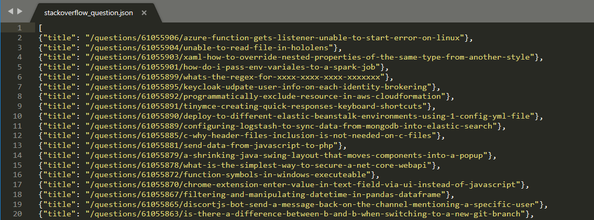
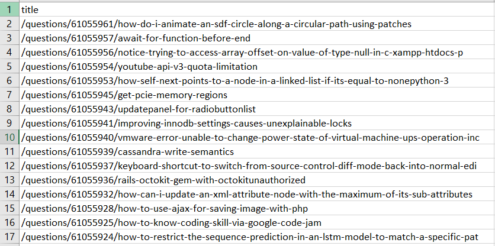

# Table of Content
- [1. Introduction](#1-introduction)
- [2. Set up the environment for scrapy](#2-set-up-the-environment-for-scrapy)
    - [2.1. Requirements](#21-requirements)
    - [2.2. Install Scrapy](#22-install-scrapy)
- [3. How to create a Scrapy project](#3-how-to-create-a-scrapy-project)
    - [3.1. Create Scrapy](#31-create-scrapy)
    - [3.2. Create Spider](#32-create-spider)
    - [3.3. Run the spider](#33-run-the-spider)
- [4. Parse the content you are interested](#4-parse-the-content-you-are-interested)
    - [4.1. Extract the data](#41-extract-the-data)
    - [4.2. Store the yield data into a file](#42-store-the-yield-data-into-a-file)
- [5. Conclusion](#5-conclusion)
- [6. Reference](#6-reference)

*** 

# 1. Introduction
[Scrapy](https://github.com/scrapy/scrapy) is a fast high-level web crawling and web scraping framework, used to crawl websites and extract structured data from their pages. It can be used for a wide range of purposes, from data mining to monitoring and automated testing.
Check the Scrapy homepage at https://scrapy.org for more information, including a list of features.

In this Scrapy Boot Camp project, you will learn:
* Set up the environment for scrapy
* How to create a Scrapy project
* Parse the content you are interested

*** 

# 2. Set up the environment for scrapy

## 2.1. Requirements
Python 3.5+ (Python 3.8 is recommended)
Works on Linux, Windows, macOS, BSD

## 2.2. Install Scrapy
The quick way for installing Scrapy is using the PIP:
```
pip install scrapy
```  

See the install section in the documentation at https://docs.scrapy.org/en/latest/intro/install.html for more details.

However, as per-requirement, you should also install the following library as well.
* lxml
* parsel
* w3lib
* twisted
* cryptography 
* pyOpenSSL  

*** 

# 3. How to create a Scrapy project
## 3.1. Create Scrapy
Before anything, we need to create a Scrapy project using template with the command below, and a new folder named "demo_project" will be created in your working folder.

```
scrapy startproject demo_project
```

<div align="center">
    
</div>  
<div align="center">
  <b></b>
</div>
<br> 

```
│  scrapy.cfg
│
└─demo_project
    │  items.py
    │  middlewares.py
    │  pipelines.py
    │  settings.py
    │  __init__.py
    │
    ├─spiders
    │  │  __init__.py
    │  │
    │  └─__pycache__
    └─__pycache__
```
## 3.2. Create Spider
After creating the scrapy project, navigate to the project folder ```demo_project```, and create a **spider** by using the command below:

```
scrapy genspider demo stackoverflow.com/questions
```

A new python script ```demo.py``` with the content below will be created automatically.
```
# 4. -*- coding: utf-8 -*-
import scrapy

class DemoSpider(scrapy.Spider):
    name = 'demo'
    allowed_domains = ['stackoverflow.com/questions']
    start_urls = ['http://stackoverflow.com/questions/']

    def parse(self, response):
        pass
```

**name**: identifies the Spider. It must be unique within a project, that is, you can’t set the same name for different Spiders.
**start_urls**: it's the starting point of the scrapy spider
**parse()**: a method that will be called to handle the response downloaded for each of the requests made. The response parameter is an instance of TextResponse that holds the page content and has further helpful methods to handle it. 
The parse() method usually parses the response, extracting the scraped data as dicts and also finding new URLs to follow and creating new requests (Request) from them.

Of course, you also can create the source file manually, create a python script and edit it like below.
```
import scrapy

class DemoSpider(scrapy.Spider):
    name = "demo"
    start_urls = ['http://stackoverflow.com/questions/']

    def parse(self, response):
        pass
```

## 3.3. Run the spider
Replace "pass" with ```print("response status is " + str(response.status))``` and run the spider with the command:
```
scrapy crawl demo
```
You will see the result like below. 200 indicates the web request has succeeded.
<div align="center">
    
</div>  
<div align="center">
  <b></b>
</div>
<br> 

# 4. Parse the content you are interested
## 4.1. Extract the data
No you've built a spider from scratch using template, and then you have to parse the content you are interested.
XPath is a language for selecting nodes in XML documents, which can also be used with HTML. CSS is a language for applying styles to HTML documents. It defines selectors to associate those styles with specific HTML elements.
XPath expressions are very powerful, and are the foundation of Scrapy Selectors. In fact, CSS selectors are converted to XPath under-the-hood. 

Open the starting URL, https://stackoverflow.com/questions and right-click -> inspect. A side menu will open with the HTML structure of the website (if not, make sure you have selected the ‘Elements’ tab). You'll have something like this:

<div align="center">
    
</div>  
<div align="center">
  <b></b>
</div>
<br> 

Navigate to the html perspective, and press Control+F, the search menu opens:
At the bottom-right, you can read "Find by string, selector or Xpath". Scrapy uses Xpath, so let's use it.
To start a query with Xpath, write '//' then what you want to find. For example, if grad all the questions, set the filter like this: ```//div[@class="question-summary"]```

You can see now that we have selected 15 elements: The 15 initial questions.
<div align="center">
    
</div>  
<div align="center">
  <b></b>
</div>
<br> 

Inside the h3 tag, there is an a tag with the question href as ```href="..."```. Let’s loop over the questions list and extract it.

```
<h3><a href="/questions/61054575/i-am-unable-to-connect-tor-browser-in-osx-following-are-log-from-it-can-anyone" class="question-hyperlink">I am unable to connect tor browser in OSX. Following are log from it. Can anyone look into this</a></h3>
```

We get all the questions, and for each one of them, we search for the ‘h3’ tag, then @href attribute. We want that text, so we use ‘extract_first‘ (we can also ‘use extract’ to extract all of them).

```
    def parse(self, response):
        all_questions = response.xpath('//div[@class="question-summary"]')
        print("response status is " + str(response.status))

        for question in all_questions:
            title = question.xpath('.//h3/a/@href').extract_first()

            print(title)
```
Run the spider, and get the result below.
<div align="center">
    
</div>  
<div align="center">
  <b></b>
</div>
<br> 

Remove the prints and **yield** the items like a dictionary:
```
    def parse(self, response):
        all_questions = response.xpath('//div[@class="question-summary"]')
        print("response status is " + str(response.status))

        for question in all_questions:
            title = question.xpath('.//h3/a/@href').extract_first()

            # print(title)
            yield {
                'title': title,
            }
```

## 4.2. Store the **yield** data into a file
Use the command below to store the yield data into a file. 
```
scrapy crawl demo -o stackoverflow_question.json
```
Wait until it’s done, and a new *.json file will be generated.
<div align="center">
    
</div>  
<div align="center">
  <b></b>
</div>
<br> 

And you can store the data into a .csv or .xml file as well.
<div align="center">
    
</div>  
<div align="center">
  <b></b>
</div>
<br>

# 5. Conclusion
In this tutorial you built a fully-functional spider from scratch using the scrapy, and extracted data with the Xpath. 

# 6. Reference 
[Scrapy Tutorial](https://docs.scrapy.org/en/latest/intro/tutorial.html)