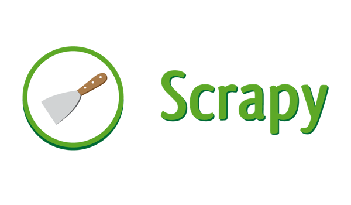

 

  

 

***

# Introduction
It's a repository used to arrange all of the information you should learn during the Python Scrapy ramping up.

# Contributing
For contributing, the recommended approach is that forking the repository firstly, and then clone your own forked repository. You can commit any useful changes to the fork, and then open a Pull Request to the upstream repository in your fork.

# License
Python Scrapy Boot Camp is released under the [Apache 2.0 license](LICENSE)

# Changelog
Revision 1.0

2020-04-06
Initial Revision

# More Documentation
## Reference
[Python Scrapy tutorial for beginners](https://letslearnabout.net/tutorial/scrapy-tutorial/python-scrapy-tutorial-for-beginners-01-creating-your-first-spider/)